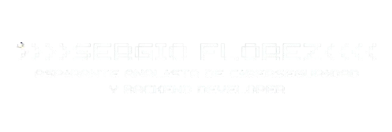

  

<h2> / sobre mí /</h2>

- 💻 aspirante a **analista de ciberseguridad & desarrollador backend**
- 🎓 estudiante de ingeniería de sistemas (tecnólogo graduado)
- 🔐 apasionado por la **ciberseguridad, redes y programación segura**
- ⚡ fuerte en **Java y resolución de problemas**
- 🚀 construyendo mi camino hacia mi **primer empleo en tecnología**

<h2> / mentalidad /</h2>

- 🧠 **analítico**
- 🔍 **curioso**
- 🧱 **persistente**
- ⚠️ enfocado en **aprendizaje con propósito**

<h2> / habilidades actuales / </h2>

- <h4> lenguajes </h4>
  
  
  
  
- <h4> actualmente aprendiendo </h4>
  
  
  

- <h4> herramientas & tecnologías </h4>
  
  
  
  

<h2> / experiencia /</h2>

- 🏢 Practicante TIC en **LA MUELA S.A.S**
  - mapeo de cableado estructurado
  - configuración e instalación de VPN
  - despliegue de antivirus en equipos
  - mantenimiento de hardware y software
  - capacitación en conciencia de ciberseguridad

<h2> / objetivos /</h2>

- 🎯 conseguir mi primer empleo en **ciberseguridad**
- 🧑‍💻 mejorar mis habilidades en **desarrollo backend**
- 🔐 especializarme en **ethical hacking y análisis de seguridad**

  

  <i>"La seguridad no es un producto, es una mentalidad."</i>

