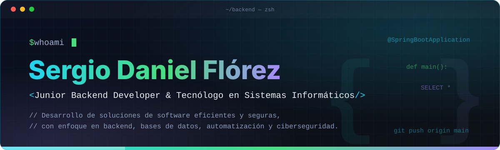

 

 

Tecnólogo en Desarrollo de Sistemas Informáticos y Desarrollador Backend Junior especializado en el diseño, desarrollo y mantenimiento de soluciones de software eficientes y seguras.

Cuento con conocimientos en **Python, Java, Spring Boot, SQL y MySQL**, además de formación técnica en **ciberseguridad**, automatización de procesos con **n8n** y desarrollo intensivo. También tengo experiencia en soporte TIC, redes, configuración de VPN, MikroTik y control de versiones con Git/GitHub.

Me caracterizo por la **resolución de problemas, adaptabilidad, trabajo en equipo, atención al usuario y comunicación efectiva**.

 

### Backend y bases de datos

### Infraestructura, redes y seguridad

### Herramientas y automatización

 

<table>
<tr>
<td width="33%" valign="top">

### TalentFlow AI

Diseño de una arquitectura híbrida para automatización y procesamiento de información, con workflows en n8n, análisis mediante Google Gemini y persistencia relacional para trazabilidad transaccional.

**Tecnologías**

  

**Aporte**

Diseño de la arquitectura híbrida.

**Enlaces**

[Ver repositorio](https://github.com/yuritrojasmantilla/TalentFlow_AI-YuritzaRojas-SergioFlorez)

</td>
<td width="33%" valign="top">

### AcmeSchool

Aplicación web cliente con módulos público y privado, autenticación, persistencia de información en el navegador, temporizador para cuestionarios y control de sesión activa.

**Tecnologías**

  

**Aporte**

Desarrollo de la aplicación web cliente.

**Enlaces**

[Ver repositorio](https://github.com/DavidNavas898/Escuela-Acme)

</td>
<td width="33%" valign="top">

### Costodev SyM

Maquetación web modular y semántica con diseño adaptativo, utilizando Flexbox, CSS Grid, Media Queries y un menú hamburguesa implementado con CSS puro.

**Tecnologías**

    

**Aporte**

Maquetación web modular y semántica.

**Enlaces**

[Ver repositorio](https://github.com/CastroMariaJ/costdev)

</td>
</tr>
</table>

 

### Auxiliar de Sistemas / Practicante TIC
**LA MUELA S.A.S · Bucaramanga, Santander**  
**Marzo 2024 – Agosto 2024**

- Optimización del rendimiento y seguridad de la red corporativa mediante el mapeo de cableado estructurado con **wire tracer**.
- Implementación de conexiones **VPN** para acceso remoto seguro.
- Administración y actualización de plataformas de ciberseguridad corporativa.
- Instalación y configuración de antivirus en el **100 % de los equipos**.
- Diseño e impartición de un programa de concientización en ciberseguridad dirigido al personal.
- Soporte técnico preventivo y correctivo de hardware y software a **más de 50 usuarios**.

 

### Campusland
**Febrero 2026 – Presente**  
Formación intensiva en desarrollo de software y programación backend.

### Ingeniería de Sistemas
**2025 – Presente**

### Tecnología en Desarrollo de Sistemas Informáticos
**2021 – 2025**  
**Unidades Tecnológicas de Santander (UTS) · Bucaramanga, Santander**

 

- **Introduction to Cybersecurity** · Cisco Networking Academy · Agosto 2026
- **SQL (Basic) Certificate** · HackerRank · Agosto 2026
- **Python Hacking: Ciberseguridad y Hacking Ético con Python** · Udemy · Enero 2026
- **Bootcamp de Ciberseguridad Básico** · Talento Tech, Bucaramanga · Agosto 2025

 

- **Español:** Nativo
- **Inglés:** Técnico, lectura y comprensión de documentación

 

**Bucaramanga, Santander, Colombia**  
**Teléfono:** +57 3142738437  
**Correo:** [sergioflorez422@gmail.com](mailto:sergioflorez422@gmail.com)  
**LinkedIn:** [linkedin.com/in/sergio-florez-129401329/](https://linkedin.com/in/sergio-florez-129401329/)  
**GitHub:** [github.com/sergioRepository](https://github.com/sergioRepository)

### Hoja de vida

 

